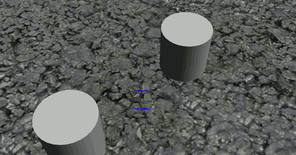

# PX4_SITL_Sim

> **Note:** The controller and simulation setup in this repository were written by Kleber Cabral. Some files come from, or are adapted from, other sources, listed under [Sources](#sources). The README documentation and inline code comments were added with AI assistance (Claude).

A Dockerized PX4/ROS Noetic/Gazebo software-in-the-loop (SITL) drone simulation environment, plus a custom ROS "offboard" controller package (`offb`) for position/velocity control of a simulated (or real) PX4 vehicle via MAVROS.



*The offboard controller (`main_FB_hdw.py`) flying a simulated PX4 quadrotor in `worlds/danger_zones.world`: takeoff, flight to the waypoint, landing. Recorded on 2026-10-06 with PX4 v1.13.3, sped up. The camera follows the vehicle and circles it once per minute of simulated time. For the recording, the world's asphalt ground texture was replaced by a plain light floor with a 1 m grid so the vehicle is easier to see.*

## Structure

```
PX4_SITL_Sim/
├── Dockerfile              # PX4 + ROS Noetic + Gazebo SITL image
├── install.sh              # (re)builds the ros-test image
├── clean.sh                # removes the image + dangling images
├── start.sh                # runs the container, mounting catkin_ws/ and host/
├── terminal.sh              # opens an extra shell into the running container
├── commands_for_sitl        # cheat-sheet of commands used inside the container
├── figures/                 # demo GIF used in this README
├── worlds/
│   └── danger_zones.world   # custom Gazebo world
├── catkin_ws/
│   └── offboard_package/    # ROS catkin workspace, mounted live into the container
│       ├── settings/        # rviz config
│       └── src/
│           └── offb/        # main catkin package (offboard controller node, launch files)
├── host/                    # runtime mount point (created by start.sh); holds recorded
│                             # rosbags and a working copy of the world file — not source, gitignored
└── legacy/
    └── start_old.sh          # superseded container-launch script, kept for reference
```

`catkin_ws/offboard_package/build/`, `devel/`, `logs/`, and `.catkin_tools/` are catkin-generated build artifacts (gitignored) — they're recreated automatically the first time you build the workspace inside the container.

## What it does

- **`Dockerfile`** builds a ROS Noetic image with a full PX4-Autopilot clone (built via its Ubuntu setup script), MAVROS, and a non-root `px4devel` user.
- **`start.sh`** runs that image, bind-mounting `catkin_ws/` and `host/` (created next to the script) into the container as `~/catkin_ws` and `~/host`, with X11 forwarding for GUI apps (Gazebo, rviz, rqt).
- **`catkin_ws/offboard_package`** is a ROS catkin package (`offb`) containing:
  - `offb/src/main_FB_hdw.py`, `offb/src/main_veltuning_hdw.py` — offboard control nodes (position/velocity setpoint control loops against MAVROS topics/services), at different stages of development (hardware feedback control, velocity tuning).
  - `offb/src/TSG.py` — a `Controller` class, referenced by the main control scripts.
  - `offb/src/utils/px4_utilities_FB.py`, `offb/src/utils/animate.py` — MAVROS helper functions and plotting/animation utilities.
- **`worlds/danger_zones.world`** is a custom Gazebo world used for SITL runs (see `commands_for_sitl` — it's loaded via `PX4_SITL_WORLD`).
- **`commands_for_sitl`** is a plain-text notes file of commands run inside the container (launching SITL/Gazebo, `roslaunch mavros`, `rqt_plot` setpoint-tracking plots, sourcing the workspace, `rostopic echo`, RC-loss parameter tuning) — useful as a runbook, not a script.

## Setup / Run

The simulation needs three shells inside the same container: one for PX4 + Gazebo, one for MAVROS and one for the controller.

**1. Build the image and prepare the world file (on the host)**

```bash
./install.sh                              # builds the ros-test Docker image
mkdir -p host
cp worlds/danger_zones.world host/        # host/ is mounted in the container as ~/host
```

**2. Shell 1: start the container, then PX4 SITL + Gazebo**

```bash
./start.sh                                # runs the container (mounts catkin_ws/ and host/, forwards X11)
```

Inside the container:

```bash
export PX4_SITL_WORLD=~/host/danger_zones.world
cd ~/PX4-Autopilot && make px4_sitl_default gazebo
```

The first run compiles PX4, which takes several minutes. When the `pxh>` prompt appears, allow arming in offboard mode without an RC link:

```
param set COM_RCL_EXCEPT 4
```

**3. Shell 2: MAVROS**

```bash
./terminal.sh                             # opens another shell in the running container
roslaunch mavros px4.launch fcu_url:="udp://:14540@127.0.0.1:14557"
```

**4. Shell 3: build and run the offboard controller**

```bash
./terminal.sh
cd ~/catkin_ws/offboard_package
catkin build
source devel/setup.bash
rosrun offb main_FB_hdw.py
```

The vehicle takes off, flies to the waypoint and lands. When the mission ends, the script opens a matplotlib plot of the flown path, the waypoint and the danger zones.

`commands_for_sitl` has more debugging one-liners (`rqt_plot`, `rostopic echo`, etc.). `clean.sh` removes the built image plus any dangling images.

The demo GIF at the top was recorded without a display: Gazebo ran headless (`HEADLESS=1`) and a camera sensor added to a copy of the world, moved around the vehicle by a small Gazebo plugin, saved the frames. The steps above, with the Gazebo window, are the interactive equivalent.

## Key dependencies

- Docker
- Everything else (ROS Noetic, PX4-Autopilot, Gazebo, MAVROS) is installed inside the image by the `Dockerfile` — no host-side ROS install required.

## Status

Working SITL setup, last actively used mid-2022. Several development-stage control scripts exist side by side (`main_FB_hdw.py` vs `main_veltuning_hdw.py`) rather than one finished entry point — check `commands_for_sitl` and the script contents to see which was the active one for a given experiment. `legacy/start_old.sh` is an earlier, non-catkin_ws-aware container launch script superseded by `start.sh`.

`TSG.py`'s flocking/danger-zone-avoidance controller (used by `main_FB_hdw.py`) depends on `sigma_norm`/`sigma_1`/`rho_h` helper math that's defined within `TSG.py` itself, so it runs standalone.

**Bugs fixed (2026-07-24):** `px4_utilities_FB.py`'s `VelocitySetpoints.updateSp` referenced an undefined `vel` instead of its own `velocity` parameter (dead code path — never actually called, only `updateSp2` is used, but fixed regardless). `main_FB_hdw.py` used to hard-`quit()` the process the instant it got within 0.1m of the mission waypoint instead of cleanly landing; removed — the existing `FB_Cont.done()` check (0.25m threshold) already transitions cleanly to the IDLE state, which ramps down and triggers `AUTO.LAND`.

**Bugs fixed (2026-10-05):** the image no longer built, because the `Dockerfile` cloned the latest PX4, whose setup script fails on this base image. PX4 is now pinned to `v1.13.3` and `USER` is set before the setup script runs. With that image, PX4 SITL, Gazebo, MAVROS and `main_FB_hdw.py` ran end to end (the GIF at the top is from a run of that image). PX4 refuses to arm in offboard mode without an RC link until `param set COM_RCL_EXCEPT 4` is entered in the PX4 console (the line is in `commands_for_sitl`).

## Cleanup notes (2026-07-24)

During reorganization, the following were removed as redundant/regenerable:
- `backup.zip` (340MB) and `SITL_docker_FB_controller.zip` (170MB) — point-in-time backups of this same workspace; both exceeded GitHub's 100MB file size limit anyway. Both contained a `git init` with **zero commits** (verified before deleting) — no history was lost.
- `kleber_docker_controller_V1.zip`/`V2.zip` — small superseded snapshots of the controller source, predating the current `catkin_ws/offboard_package/src`.
- A stale top-level `offboard_package/` directory that duplicated `catkin_ws/offboard_package/` but was missing files present in the latter (the live/mounted copy).
- An empty, commit-less `.git/` directory nested inside `catkin_ws/offboard_package/` (would otherwise behave like a broken submodule link once this project became its own repo).

## Sources

Some files in this repository come from, or are adapted from, other sources. The ones identified are:

- The PX4 User Guide's MAVROS offboard control example (C++), https://docs.px4.io/main/en/ros/mavros_offboard_cpp (CC BY 4.0).
- Mohamed Abdelkader's PX4 offboard test script in https://github.com/mzahana/px4_indoor_navigation (flight-mode service wrappers).
- The sample launch file of `vrpn_client_ros`, https://github.com/ros-drivers/vrpn_client_ros, and the MAVROS launch files, https://github.com/mavlink/mavros.
- The Docker GUI tutorial on the ROS wiki, http://wiki.ros.org/docker/Tutorials/GUI.

**Removed (2026-10-08):** a GPS-origin script and three copies of a square-pattern offboard demo, because their sources' licences (GPL-3.0, and no licence) do not allow publishing them under this repository's MIT licence. The SITL steps above never used them.

## License

MIT — see [LICENSE](LICENSE).
